# Eye-deal Optics
(Developer: David Trevaskis)

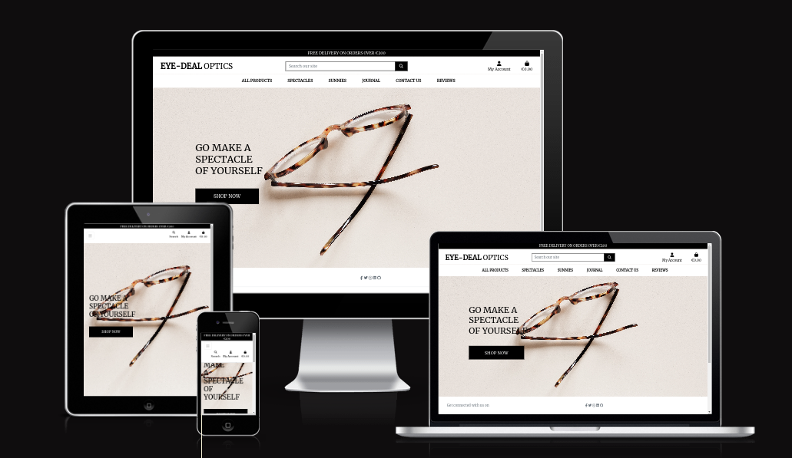

**Live Site:**

You can reach the live site [here](https://eye-deal-e27624539e49.herokuapp.com/)

**Link to Repository:**

[Repository](https://github.com/DaveTrev/eye_deal)

**Developed by: David Trevaskis**

Eye deal optics is a optical retail e-commerce site. It sells limited ranges of bespoke and handmade spectacle frames and sunglasses. 

This is for educational purposes only, please don’t enter your card details.
If you want to test the payment system, use these test card details:  
Card Number: 4242 4242 4242 4242  
Date: 0424  
CVC: 242  
Postcode: 42424

# Business Model 
Eye Deal optics is a B2C business. The business sells optical and sun frames from small boutique makers from around the world. We advertise on Facebook, users can share the page to spread the word on the latest trends and pieces . The online store will sell and deliver goods to purchasing customers and all marketing will be done digitally.

# User-Experience-Design

## Site Goals

The site is aimed at anyone that wants to buy a bespoke frame and wants to stand out from crowd. Without signing in the user can browse the online store.
They can also look at the site blog to see the musings from the business owner.
They can log in to see a log of the items they have bought. They can also save their details for future purchases.

## Agile Planning

This project was developed using agile methodologies, delivering small features over  sprints spaced out over  weeks. 
The must-have features were completed first, then the should have's, then the could have's.  It was done this way to ensure a complete website is made with the nice-to-have features added if there is capacity.

### **Milestones** 
- Home
- Registration
- Products
- Basket
- Checkout
- Payment 
- Profile 
- Admin
- Reviews
- Contact
- Journal
- Readme & Testing

#### **Sprints**  

1. Full CRUD
2. checkout functionality
3. ui/ux updates, mailchimp, meta descriptions, sitemap, robot.txt, 404 facebook mockup, favicon
4. Finishing documentation, SEO, meta data, facebook page,

The user stories were grouped into different Epics

Epic 1 - Set up

- Nothing can be done before the Django app's basic setup is finished, this was the first issue to tackle

Epic 1 user stories

- As a developer, it is my responsibility to set up the project so that its essential features may be implemented.
- I want to build a foundation HTML page as a developer so that every page can have the same structure.
- I want to be able to just browse the website on any device as a user.e

Epic 2 - Products and shopping bag

- Establishing the database model, admin features, and template pages so that users can see the things that are for sale and receive notifications when new items are added to their bags.

Epic 2 User Stories

- As a User I want to be able to click into a product to examine its details. 
- As a User I want to be able to view a list of products so that I may choose something to buy.
- As a User I want to be able to see the items I have put to my shopping bag and the total cost as a user.
- As a User When I decide I no longer desire something, I should be allowed to remove it from my bag.
- As a User In order for me to know when a change has been finished, I would like to get a confirmation when I make changes, such as adding or deleting things from my bag.

Epic 3 - payment and purchase confirmation emails.

Epic 3 User Stories

- As a User I want to be able to quickly submit my payment information so that I can buy the things I've selected.
- As a User In order for me to feel certain that everything was done correctly, I need to see proof that my payment was processed and that my item is being delivered to the right address.
- As a customer, I would want to receive an email from Eye-deal with a purchase confirmation for my personal file.

Epic 4 Allauth User Stories

- I want to be able to sign up quickly and simply as a new user.
- As a recurring user, I would like to have an easy time logging in.
- I want to be able to quickly and safely log out of the website as a user.
- As a developer, I want to make sure that every form has the same aesthetic and appears great across all platforms.
- As a developer, I require email confirmation and secure accounts. 

Epic 5 - Profile Page
 - As a User, I want to be able to access a profile page so that I can see my order details.
 - As a User, I want to see what purchases I have made in the past.
 - As a User, I want to be able to update my details if I change address.

Epic 6 - Blog / Journal

- As a User I want to be able to see further information on optical trends.
- As a site owner I want to easily be able to add blog entries onto the Site
- As a site owner I want to be able to edit my blog posts so that I can make corrections easily and quickly.
- As a site owner I want to be able to delete blog posts as necessary.
- As a site owner I want to be the only one who can create edit and delete blog posts

Epic 7 - Reviews

Epic 7 User Stories

- As a User, I would like to be able to read reviews about the site so I can decide if I want to use it
- As a User I want to be able to leave feedback to both the site owner and other users.
- As a user, I want to be able to give my review a rating out of five for ease of reference

Epic 8 - Contact page

Epic 8 User Stories

- As a User, I would like to be able to be able to directly contact the site owner with queries and issues.

Epic 9 Footer

Epic 9 User Stories

- As the site owner, I want to share social media links and contact details
- As the site owner, I want a nav bar for the site extras such as the terms and conditions pages

Epic 10 - Documentation and styling

Epic 10 Tasks

- Full Style across all pages and screen widths
- The whole Readme file
- Finish testing and writing up

## **Skeleton Plane**  
### **Wireframes** 
Prior to writing any code, initial wireframes were drawn with pencil and paper. Once happy with the layout and design, I used [Wireframepro](https://wireframepro.mockflow.com/) to create my wireframes.
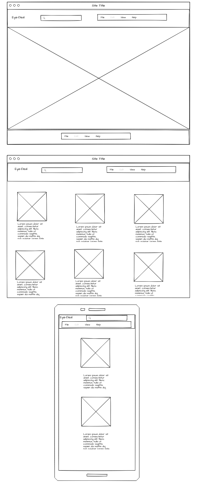

### **Database Diagram**
Below is my database diagram and the relationships between them. 
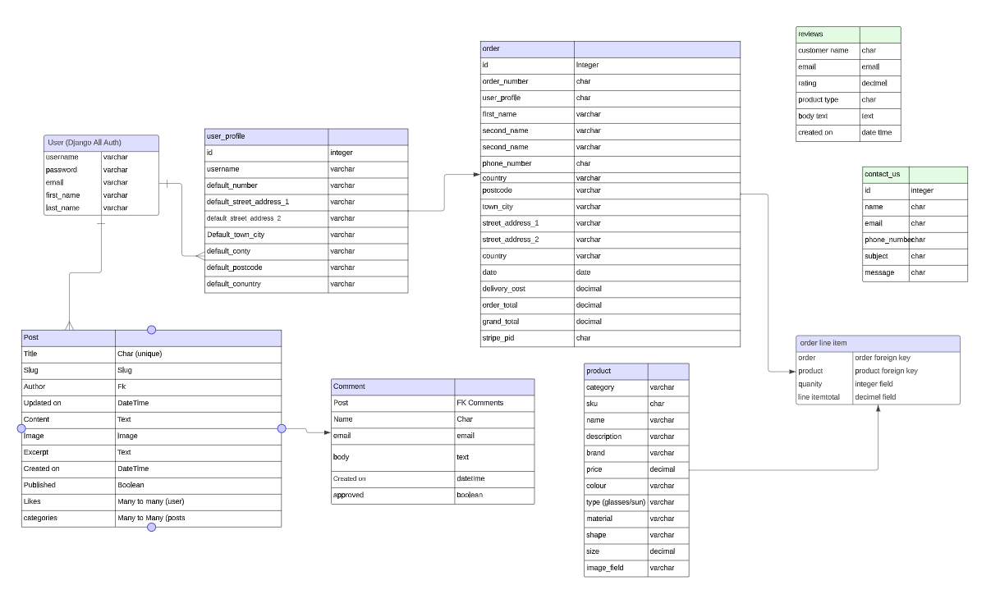

#### Product

| Field Name   | Field Type     | Additional Properties        | Choices                           | Max Length |
|--------------|----------------|------------------------------|-----------------------------------|------------|
| name         | CharField      | N/A                          | N/A                               | 254        |
| price        | DecimalField   | max_digits=10, decimal_places=2 | N/A                           | N/A        |
| image        | ImageField     | null=True, blank=True         | N/A                               | N/A        |
| brand        | CharField      | N/A                          | N/A                               | 254        |
| sku          | CharField      | N/A                          | N/A                               | 50         |
| description  | TextField      | N/A                          | N/A                               | 800        |
| colour       | CharField      | N/A                          | N/A                               | 50         |
| gender       | CharField      | N/A                          | N/A                               | 50         |
| type         | CharField      | Glasses, Sunglasses          | N/A                               | 50         |
| material     | CharField      | Acetate, Metal, Titanium     | N/A                               | 50         |
| shape        | CharField      | N/A                          | N/A                               | 50         |
| size         | CharField      | N/A                          | N/A                               | 50         |
| category     | ForeignKey     | on_delete=models.SET_NULL, null=True, blank=True | N/A             | N/A        |

#### Review
| Field Name    | Field Type    | Additional Properties        | Choices                           | Max Length |
|---------------|---------------|------------------------------|-----------------------------------|------------|
| customer_name | CharField     | null=False, blank=False      | N/A                               | 50         |
| email         | EmailField    | null=False, blank=False      | N/A                               | N/A        |
| rating        | DecimalField  | max_digits=6, decimal_places=2, validators=[MinValueValidator(0), validate_rating] | N/A | N/A        |
| product_type  | CharField     | N/A                          | Glasses, Sunglasses               | 50         |
| body_text     | TextField     | N/A                          | N/A                               | N/A        |
| created_on    | DateTimeField | auto_now_add=True            | N/A                               | N/A        |

#### Order

| Field Name      | Field Type     | Additional Properties        | Choices                           | Max Length |
|-----------------|----------------|------------------------------|-----------------------------------|------------|
| order_number    | CharField      | null=False, editable=False   | N/A                               | 32         |
| user_profile    | ForeignKey     | on_delete=models.SET_NULL, null=True, blank=True, related_name='orders' | N/A | N/A        |
| full_name       | CharField      | null=False, blank=False      | N/A                               | 50         |
| email           | EmailField     | null=False, blank=False      | N/A                               | 254        |
| phone_number    | CharField      | null=False, blank=False      | N/A                               | 20         |
| country         | CountryField   | blank_label='Country *', null=False, blank=False | N/A             | N/A        |
| postcode        | CharField      | null=True, blank=True        | N/A                               | 20         |
| town_or_city    | CharField      | null=False, blank=False      | N/A                               | 40         |
| street_address1 | CharField      | null=False, blank=False      | N/A                               | 80         |
| street_address2 | CharField      | null=True, blank=True        | N/A                               | 80         |
| county          | CharField      | null=True, blank=True        | N/A                               | 80         |
| date            | DateTimeField  | auto_now_add=True            | N/A                               | N/A        |
| delivery_cost   | DecimalField   | null=False, default=0        | N/A                               | 6,2        |
| order_total     | DecimalField   | null=False, default=0        | N/A                               | 10,2       |
| grand_total     | DecimalField   | null=False, default=0        | N/A                               | 10,2       |
| original_bag    | TextField      | null=False, blank=False, default='' | N/A                       | N/A        |
| stripe_pid      | CharField      | null=False, blank=False, default='' | N/A                       | 254        |

#### Order line item
| Field Name     | Field Type    | Additional Properties        | Choices                           | Max Length |
|----------------|---------------|------------------------------|-----------------------------------|------------|
| order          | ForeignKey    | null=False, blank=False      | N/A                               | N/A        |
| product        | ForeignKey    | null=False, blank=False      | N/A                               | N/A        |
| quantity       | IntegerField  | null=False, blank=False, default=0 | N/A                        | N/A        |
| lineitem_total | DecimalField  | max_digits=6, decimal_places=2, null=False, blank=False, editable=False | N/A | N/A        |

#### User Profile

| Field Name           | Field Type     | Additional Properties        | Choices                           | Max Length |
|----------------------|----------------|------------------------------|-----------------------------------|------------|
| user                 | OneToOneField  | on_delete=models.CASCADE     | N/A                               | N/A        |
| default_phone_number | CharField      | null=True, blank=True         | N/A                               | 20         |
| default_street_address1 | CharField   | null=True, blank=True         | N/A                               | 80         |
| default_street_address2 | CharField   | null=True, blank=True         | N/A                               | 80         |
| default_town_or_city  | CharField     | null=True, blank=True         | N/A                               | 40         |
| default_county       | CharField      | null=True, blank=True         | N/A                               | 80         |
| default_postcode     | CharField      | null=True, blank=True         | N/A                               | 20         |
| default_country      | CountryField   | blank_label='Country *', null=True, blank=True | N/A             | N/A        |

#### Contact form

| Field Name       | Field Type    | Additional Properties        | Choices                           | Max Length |
|------------------|---------------|------------------------------|-----------------------------------|------------|
| contact_reason   | CharField     | default="general_query", null=False, blank=False | CONTACT_REASONS | 100        |
| name             | CharField     | null=False, blank=False      | N/A                               | 50         |
| email            | EmailField    | null=False, blank=False      | N/A                               | 250        |
| message          | TextField     | null=False, blank=False      | N/A                               | 400        |

#### Post

| Field Name  | Field Type    | Additional Properties        | Choices                           | Max Length |
|-------------|---------------|------------------------------|-----------------------------------|------------|
| title       | CharField     | unique=True                  | N/A                               | 200        |
| slug        | SlugField     | unique=True                  | N/A                               | 200        |
| author      | ForeignKey    | on_delete=models.CASCADE, related_name="blog_posts" | N/A             | N/A        |
| updated_on  | DateTimeField | auto_now=True                | N/A                               | N/A        |
| content     | TextField     | N/A                          | N/A                               | N/A        |
| image       | ImageField    | null=True, blank=True        | N/A                               | N/A        |
| excerpt     | TextField     | N/A                          | N/A                               | N/A        |
| created_on  | DateTimeField | auto_now_add=True            | N/A                               | N/A        |
| published   | BooleanField  | default=False                | N/A                               | N/A        |
| likes       | ManyToManyField| related_name='blog_likes', blank=True | N/A                       | N/A        |
| categories  | ManyToManyField| related_name='posts'         | N/A                               | N/A        |

#### Comment

| Field Name  | Field Type   | Additional Properties  | Max Length |
|-------------|--------------|------------------------|------------|
| post        | ForeignKey   | on_delete=models.CASCADE, related_name='comments' | N/A |
| name        | CharField    | null=False, blank=False | 80         |
| email       | EmailField   | null=False, blank=False | 250        |
| body        | TextField    | null=False, blank=False | N/A        |
| created_on  | DateTimeField| auto_now_add=True      | N/A        |
| approved    | BooleanField | default=True           | N/A        |

## **Surface Plane**

### **Colours** 
The Spectacle frames at the store are vibrant and colourful, therefore the main colours chosen for the website are neutral which avoids any colour clashes.

### **Typography** 
The font for the website was chosen using [Google Fonts](https://fonts.google.com/). I decided to use the font 'Merriweather '. "Meriweather is quite popular and one of the widely used brand fonts for websites. Especially for the e-commerce ones. Indeed, it is pleasant to look at because of its condensed letterforms. Also, it is ideal for font pairings. If you wish to have a high-end brand image, then Merriweather is the best fonts style for it!"
Taken from [Code Theorem](https://codetheorem.co/blogs/best-fonts-for-ecommerce-website)

### **Features**

- Desktop Header 
The header is consistent on all pages. For larger screen sizes, the header will display a all products link, logo, accounts, glasses, sunnies, journal, contact, reviews and basket. 
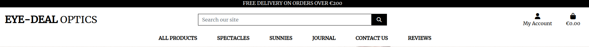

- Mobile Header 
The header is consistent on all pages. For medium and smaller screen sizes, the leagues condense into a burger menu. The search icon, accounts, and basket are also displayed in the mobile header. 
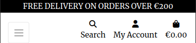

- Logo 
The logo has an imprtant role in the navigation of the website. Users can always return to the home page by clicking on the logo in the header. 
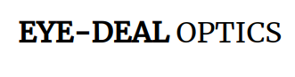

- Search Bar 
Customers use the search bar to look for particular products. A list of search results will appear for the customer to peruse if the product's name or description contains the term they are searching for. 
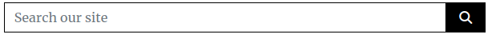

- Dropdowns 
The dropdown menus were created to store additional pages without cluttering the main menu for a more finished look and better site structure. The two dropdown’s are ‘All Products’ and ‘My Account’. 
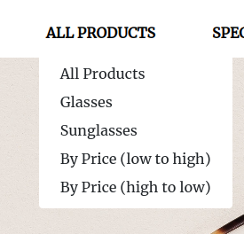
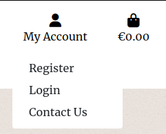

- Bag Icon
This allows site users to always view the basket total. 
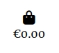

- Alert Messages 
Alert messages are very important in communicating back to the user once an action is taken. 
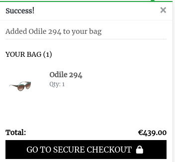 

- Register for an account 
Users can register for an account through the 'Register' page. 
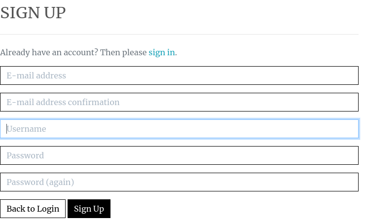

- Log in 
Site users can log in to their account once they have registered. 
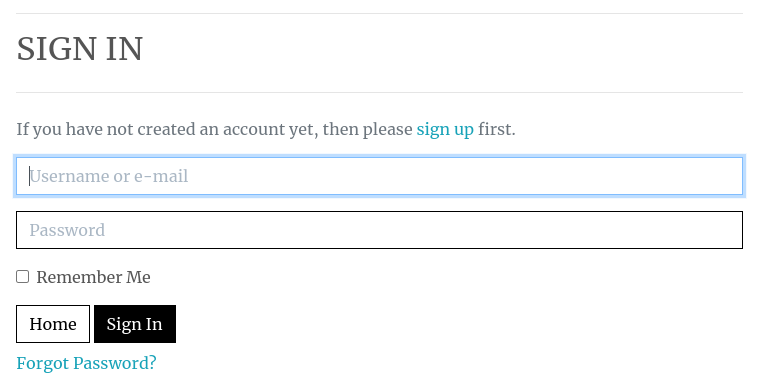

- Logout 
Site users can log out of their account. 
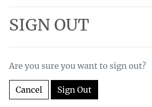

- Password Reset 
The user has the ability to reset their password using the 'Forgot my password' link. 

- Products Cards  
The products are displayed on cards which stack on top of each other neatly once the screen size is reduced.  
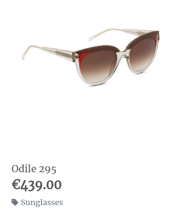

- No Image 
If a product is added to the store without an image. The no image placeholder image will take its place. 

- Filtering 
The users can filter the products using the ‘Sort by…’ dropdown. 
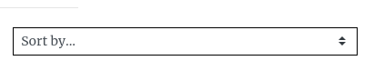 

- Back to Top Button 
The back to top button plays an important role in the navigation of the website. The button is placed on the right of the screen and uses the [Font Awesome](https://fontawesome.com/) arrow-up icon. 
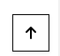

- Product Count 
The product count tells users how many products are available in their search or in the specific league category. 
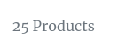

- Product Detail 
The product detail page includes the image, name, price, size and description. Below that there is a 'Keep Browsing' and an 'Add to Basket' button. 
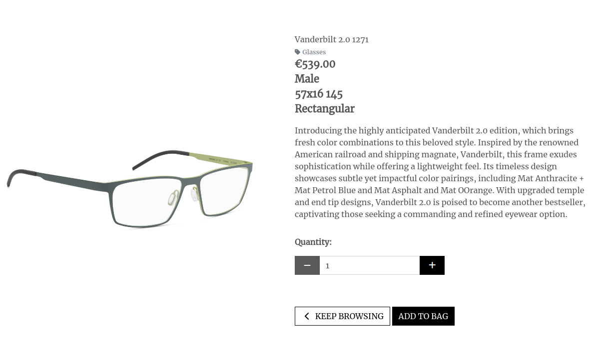

- Mailchimp Newsletter 
The purpose is to get users to sign up to create a mailing list for email marketing. 

### **Future Features**
- Stock Tracker
- Filtering by size
- Adding Podcast links to Journal section

 

 

# **Marketing Strategy**
The marketing strategies chosen for Eye-Deal will be SEO, Social Media Marketing and Email Marketing. Pages such as robots.txt, sitemap and privacy policy help SEO ranking.
These will all be covered in more detail below.

 

 

### **Search Engine Optimization (SEO)**
Keywords were identified through [Wordtracker](https://www.wordtracker.com/search) and [Google Trends](https://trends.google.com/home). These tools helped me identify what keywords users are searching for. To test the relevance of the keywords, each keyword was entered into [Google](https://www.google.com/) to find out the number of results and search suggestions, the most relevant were added to the keyword list. Once chosen the most suitable, these keywords were included in meta tags, titles, descriptions, headings and the content throughout the website to improve the SEO ranking. 
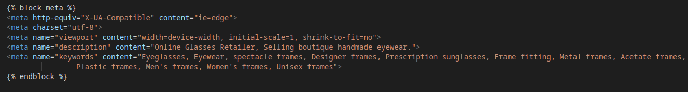

 

 

### **Robots.txt**
A robots.txt file was created. This improves the SEO ranking of the website by telling the search engine where not to go and which pages they can't crawl. 

 

 

### **Sitemap**
A sitemap file with a list of important URLs is important for search engines to crawl the website and easily understand the site structure when navigating it. The sitemap was created using [XML-sitemaps.com](https://www.xml-sitemaps.com/).

 

 

### **Social Media Marketing** 
Social media marketing will be integral to the success of Eye-deal. The most popular platform for social media marketing is Facebook: [Eye-Deal Optics Facebook](https://www.facebook.com/people/Eye-Deal-Optics/61554309323903/). This platform provides a link to the website, contact details and opening times. The social media accounts will be used to create interactive posts promoting new stock and encouraging sign-ups, driving traffic to the website and encouraging two-way communication.
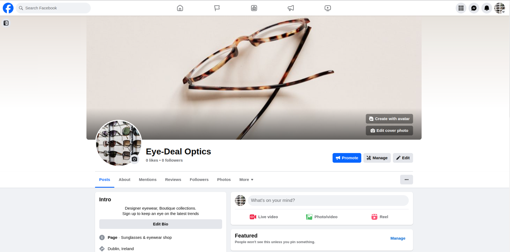

 

 

### **Email Marketing** 
Creating a mailing list for email marketing by using the 'Sign Up to Newsletter' option. Every month, the store will add new things to its inventory. First access to these products will be granted to users who have subscribed to the newsletter. Email marketing will be utilised to drive visitors to the website by means of weekly newsletters with a call to action sent out via [Mail Chimp](https://mailchimp.com). The power and ease of mailchimp is very impressive, going forward newsletters can be designed with ease to reach out to customers and drive business.

 

 

### **Privacy Policy**
The [Privacy Policy Generator](https://www.termly.io/) was employed to write Eye-Deals privacy policy. This should be prominently displayed on the website as it explains to visitors how and why we gather their personal data. Search engine algorithms will consider the website reliable and give it priority over websites without one, as a matter of SEO and marketing strategy.

 

 

## Testing

For all testing, please refer to the [TESTING.md](TESTING.md) file.

# Deployment

## **Code Institute Template**
1. Click the 'Use This Template' button.
2. Name your repository and write a description (optional).
3. Click the 'Create Repository from Template' to create the repository.
4. Click the 'GitPod' button to create a new workspace.
5. When working on the project, ensure to open the workspace from GitPod, this will open your previous workspace ratehr than creating a new one.
6. Use the following commands to commit your work:
- 'git add' adds all the modified files to a staging area.
- 'git commit -m "Write commit message"' commits the changes to the local repository.
- 'git push' pushes all your committed changes to the GitHub repository.

 

 

### **Django Setup**
1. In the terminal enter, pip3 install 'django<4'.
2. Then enter, django-admin startproject *your project name*
3. You will see the django project folder, including settings.py and urls.py.
4. Back to the terminal, enter touch .gitignore.
5. In the .gitignore file enter, *.sqlite3 and *.pyc and __pycache__
6. Run the project by entering python3 manage.py runserver to check it is running well. 
7. Your page should show a rocket with 'The install worked successfully! Congratulations!' below it.
8. Back in the terminal CTRL + C to quit the server.
9. To migrate enter, python3 manage.py migrate.
10. To create a superuser enter, python3 manage.py createsuperuser.
11. Provide username, email and password.
12. Then, git add . in the terminal
13. Then, git commit -m *"your commit message"*
14. Finally, git push to push the changes. 

 

 

### **ElephantSQL Setup**
1. Open ElephantSQL.
2. Register or Login.
3. Click 'Create New Instance'. Create a name and select a region.
4. Confirm new instance by clicking 'Create Instance'.
5. Click the instance you created.
6. Copy the URL to the clipboard.
7. Paste it into your DATABASE_URL = "enter url here" in .env file.

 

 

### **Heroku Setup**
1. Open Heroku.
2. Register or Login.
3. Click 'Create New App'.
4. Enter app name and select the region.
5. Click 'Create App'.
6. Under the 'Deploy' tab, click 'Connect to GitHub'.
7. Enter your GitHub credentials.
8. Search for your repository and click 'Connect'.
9. In the 'Settings' tab, scroll to 'Reveal Config Vars' and copy the ElephantSQL URL from the .env file.
10. In config vars, set PORT to 8000 and add the SECRET_KEY from the .env file.

 

 

### **Stripe Setup** 
1. Register for a [Stripe](https://stripe.com/gb) account.
2. Go to 'Developers' on 'Dashboard'.
3. Go to 'API Keys' to view public and secret key.
4. In .env file add STRIPE_PUCLIC_KEY AND STRIPE_SECERET_KEY.
5. Copy in public and secret keys from Stripe.
6. Head to Heroku and open the app.
7. Click on 'settings' and 'Reveal Config Vars'
8. Add the STRIPE_PUCLIC_KEY AND STRIPE_SECERET_KEY with their keys from Stripe.

 

 

### **Amazon Web Services**
1. Create a [Amazon AWS](https://aws.amazon.com/) account.
2. Open S3 application and create a bucket.
3. Select an AWS Region.
4. Uncheck the 'Block All Public Access' setting and acknowledge that the bucket will be public.
5. In 'Properties', go to the 'Static Website Hosting' and click 'Edit'.
6. Turn on 'Static Website Hosting' and set index.html and errors.html values.
7. In 'Permissions', click 'Edit' on the CORS configuration.
8. Edit 'Bucket Policy' and generate and set configuration 'Bucket Policy'.
9. Go to 'Access Control List' and set list object permission for everyone.
10. Open IAM application and set up a user group.
11. Click on 'Policies' and 'Create Policy'.
12. Click on the JSON tab and import a pre-built Amazon policy called AmazonS3FullAccess.
13. Set following settings in JSON tab.
14. Click 'Review Policy', and provide name and description then 'Create Policy'.
15. Navigate to 'Groups' then 'Permissions' and 'Add Permission' then 'Attach Policy'.
16. Click 'Add User' and create one.
17. Add the user to the group and download the CSV with the user's access credentials.
18. Add the AWS code in settings.py with an environment variable called USE_AWS.

 

 

### **Google Mail**
1. Create a [Gmail](https://mail.google.com) account.
2. Login and go to settings and click Other Google Account Settings.
3. Turn on two-step verification following the steps to enable it.
4. Once verified click on app passwords. Select 'Other' and provide a name. 'Django' for example.
5. Click 'Create' and a 16-digit password will generate. Copy it to your clipboard.
6. In the .env file, add EMAIL_HOST_PASS with the 16-digit password.
7. In the .env file, add EMAIL_HOST_USER with the email address from your gmail account. 
8. Confirm the following values in settings.py and add the variables to your config vars in Heroku to send real emails.

 

 

## **Development**
### **Fork**
1. Log into GitHub and click on repository to download
2. Click the 'Fork' button in the top right-hand corner
3. Select a different owner if necessary
4. Click on 'Create Fork'
5. The repository is now in your account and can be changed (Changes made to a forked repository will not affect the original).

 

 

### **Clone** 
1. Navigate to the main repository page.
2. Click on the 'Code' dropdown menu above the list of files.
3. Choose a method to copy the URL for the repository.
4. In the work environment, open Git Bash and change the current directory to target location for cloned repository.
5. Type 'git clone' followed by the copied URL and press 'Enter'.

 

 

### **Download ZIP**
1. Log into GitHub and click on the repository to download.
2. Select 'Code' and click 'Download Zip'.
3. Once the download is finished, extract ZIP file and use it in the local environment.

 

 

## Credits

### **Technologies Used** 
- [HTML5](https://www.w3schools.com/html/) was used to create the structure of the website.
- [CSS3](https://www.w3schools.com/css/) was used to style the website.
- [JavaScript](https://www.javascript.com/) was used to add interactivity to the website.
- [Python](https://www.python.org/) was used to build the backend of the website.
- [Django](https://www.djangoproject.com/) was used to build the website.
- [Django Allauth](https://django-allauth.readthedocs.io/en/latest/) was used for all account management.
- [Django Crispy Forms](https://django-crispy-forms.readthedocs.io/en/latest/) was used to render the website forms.
- [PostgresSQL](https://www.postgresql.org/) was used as the database during development.
- [Gunicorn](https://gunicorn.org/) was used to run the application.
- [Bootstrap](https://getbootstrap.com/docs/4.3/getting-started/introduction/) was used to style the website content.
- [Git](https://git-scm.com/) was used for version control to commit and push to GitHub.
- [GitPod](https://www.gitpod.io/) was used as the development environment. 
- [GitHub](https://github.com/) was used to store the code.
- [Chrome DevTools](https://developer.chrome.com/docs/devtools/) was used to fix errors and test responsiveness.
- [Heroku](https://heroku.com/) was used to deploy the website.
- [Elephant SQL](https://www.elephantsql.com/) was used to host the database.
- [Lucid App](https://www.lucidchart.com/) was used to create erd diagram
- [Font Awesome](https://fontawesome.com/) was used for the website icons.
- [Google Fonts](https://fonts.google.com/) was used for the website font.
- [Stripe](https://stripe.com/gb) was used to process the card payment functionality. 
- [Amazon AWS](https://aws.amazon.com/) was used to store the static and media files.
- [Pexels](https://www.pexels.com/) was used for the image on the 'home' page.
- [Grammarly](https://www.grammarly.com/) was used to check the grammar of the website content.
- [Termly](https://termly.io/products/refund-return-policy-generator/) was used to create the returns policy.

Below are links I have used, I am conscious to include all links, to avoid any unwarranted plagerism. This project was the toughest yet and I know ive pulled from alot of resources:

- The Boutique Ado walkthrough was used as a boiler plate for this project.

- The "think therefore I am" walkthorugh was also used to help create the journal section of the site.

- the [kitbag](https://github.com/dansantinojones/the-kitbag/tree/main) and [retro reboot](https://github.com/adamgilroy22/retro-reboot/tree/main), 
provided tons of insipration for work on this project, projects and work I could only aspire to!

- all images are taken from either pexels or unsplash

- orgreen optics 
https://orgreenoptics.presscloud.com/digitalshowroom/#/gallery
Any product is used for educational purposes only

- adding a blog
https://claritydev.net/blog/adding-a-blog-to-your-django-website

- adding a contact us form 
https://www.twilio.com/blog/build-contact-form-python-django-twilio-sendgrid

- building an image gallery with django
https://reintech.io/blog/building-image-gallery-in-django

- 404 page image
https://unsplash.com/photos/silver-framed-eyeglasses-on-wooden-surface-KZa_RBuBLu4 
https://www.pexels.com/photo/red-sunglasses-on-pink-surface-1532244/

- Journal / blog
https://github.com/adamgilroy22/retro-reboot/tree/main
CI I think therefore i blog

- contact us form:
https://medium.com/@k.lancemeister/django-crispy-forms-cb6f97200299
https://www.youtube.com/watch?v=w4ilq6Zk-08

- reviews
https://michaelstromer.nyc/books/intro-to-django/django-reviews

- wishlist
https://data-flair.training/blogs/python-django-wishlist-app/

- Inspiration for journal app
https://cubitts.com/blogs/journal?TN 

- designing for the visually impaired / low vision
https://fuzzymath.com/blog/improve-accessibility-for-visually-impaired-users/

- SEO keywords
https://www.wordtracker.com/search
https://www.shapedivider.app/

- adding wishlist to profile app
https://stackoverflow.com/questions/51230409/how-to-assign-userprofile-with-wishlist-without-using-a-default-user

- Generating sku codes
https://www.3dsellers.com/free-tools/sku-generator

- jquery
https://releases.jquery.com/

- django key generator
https://miniwebtool.com/django-secret-key-generator/

- xmlsitemap
https://www.xml-sitemaps.com/

- Favicon.io 
https://favicon.io/favicon-generator/e

- bootstrap footer 
https://mdbootstrap.com/docs/standard/navigation/footer/

- generating returns policy, privacy policy
https://app.termsfeed.com/

- cropping images (fantastic site for bulk cropping)
https://bulkimagecrop.com/ 

- webhook handler pep8 linter
https://stackoverflow.com/questions/45346575/what-does-noqa-mean-in-python-comments 

- added all auth instead of from django.contrib.auth.views import LoginView
https://django-allauth.readthedocs.io/en/latest/

- Create about page with model / possible seperate app
https://www.dennisivy.com/django-class-based-views

- Creating user registration, login and logout with django
https://ordinarycoders.com/blog/article/django-user-register-login-logout

- CRUD
https://www.geeksforgeeks.org/django-crud-create-retrieve-update-delete-function-based-views/?ref=lbp

- Working with forms 
https://docs.djangoproject.com/en/3.1/topics/forms/#working-with-form-templates

- Mixin messages
https://www.youtube.com/watch?v=pOXqvzVCeSM

- Mixin messages with class based views
https://docs.djangoproject.com/en/3.2/ref/class-based-views/mixins-single-object/#django.views.generic.detail.SingleObjectMixin.get_context_data

- getbootstrap
https://getbootstrap.com/

- Bootstrap cheat sheet
https://getbootstrap.com/docs/5.0/examples/cheatsheet/

- Bootstrap grid system
https://www.youtube.com/watch?v=Wqu-d_b3K-0

- Django for beginners (A fantastic book)
https://djangoforbeginners.com/

- 404 page (how to)
https://www.geeksforgeeks.org/django-creating-a-404-error-page/

- Form validation
https://www.dark-hamster.com/application/how-to-display-form-error-in-django/

- Crispy forms how to 
https://www.youtube.com/watch?v=MZwKoi0wu2Q&t=369s

- Styling forms with bootstrap 
https://www.youtube.com/watch?v=6-XXvUENY_8

- add all auth instead of from django.contrib.auth.views import LoginView
https://django-allauth.readthedocs.io/en/latest/

- landing page image
https://www.pexels.com/photo/stylish-eyeglasses-placed-on-beige-surface-4226877/

- wireframe 
https://wireframepro.mockflow.com/editor.jsp?editor=on&publicid=Me55d7974c8b9921ba0e8317d6a0614db1697961926877&perm=Create&projectid=MxuLS39jMh&spaceid=MqwXAeI7Lpb&ptitle=p5%20-%20eyedeal&bgcolor=white&category=web&pcompany=C7b4955d147c64bb6990d17826f0d480e&space=MqwXAeI7Lpb#/page/188b81619924412797f2a96d32f9d838

- Bootstrap Product List Carousel for Ecommerce Website
https://www.tutorialrepublic.com/snippets/preview.php?topic=bootstrap&file=product-list-carousel-for-ecommerce-website

## Acknowledgements

I would like to thank:

- As always, many many thanks to my better half Jenny and my kids Rose and Ollie for their ongoing patience while I worked on this final project and disappeared for weeks / months. Jenny has endured a very absent partner over the last 52 weeks, while also becoming my rubber duckie for problem solving, this will never be forgotten.
- To my faithful dog Ziggy, who helps me get out the door on many a walk, decompressing and figuring problems out while away from the screen.
-  I would like to thank my mentor [Jubril Akolade](https://github.com/Jubrillionaire) whos support and patience helped guide me through this project.
- My fellow students in no particular order [Paul Gleeson](https://github.com/Shaga-Matula), [Indrek Mannik](https://github.com/Inc21), 
[Lornavav](https://github.com/Lornavav), [Darragh](https://github.com/d-lynch95), [Dayana](https://github.com/Dayana-N) and [Brendan Cooney](https://github.com/BrendanCooney)
 for all the advice, support and picking apart the puzzles that coding presents. 
- Cohort facilitator Paul Thomas O'Riordan, for their general advice and support through out this course. 
- The invaluable Slack community and tutors at tutor support, really helping in times of need.
- This project was brought you by the power of............Cups of coffee = 74
