# Testing

Return back to the [README.md](README.md) file.

I've run a lot of tests throughout the project's development to make sure the website functions properly. All of the site's testing are documented in this area.

## Code Validation

I have validated all of my code using the recommended tools for each language.

### HTML

I have used the recommended [HTML W3C Validator](https://validator.w3.org) to validate all of my HTML files.

| Index | 
 
Pass: No Errors 

| All Products |
  
Pass: No Errors 

| Individual Product | 
 
Pass: No Errors

| Contact|
 
Pass: No Errors

| Journal | 
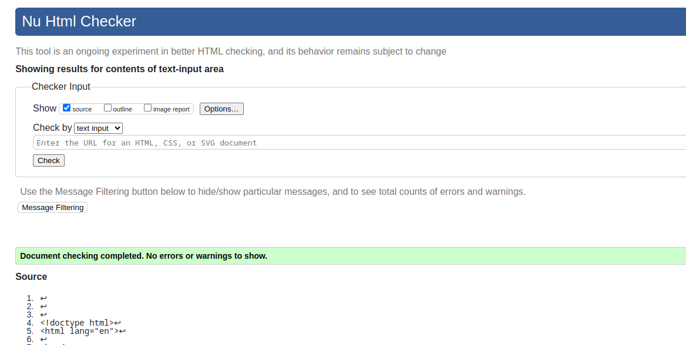 
Pass: No Errors 

| Journal Post | 
 
**Error**: The  `font`  element is obsolete.  [ Found late in submission process to return and fix ]

| Register | 
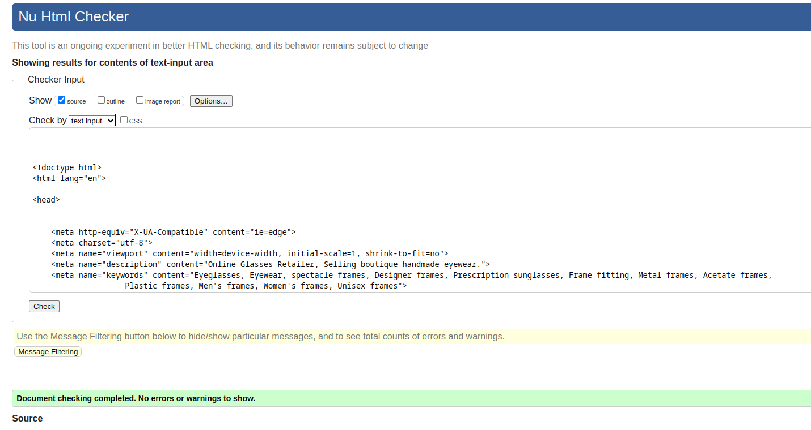
Pass: No Errors 

| Login |
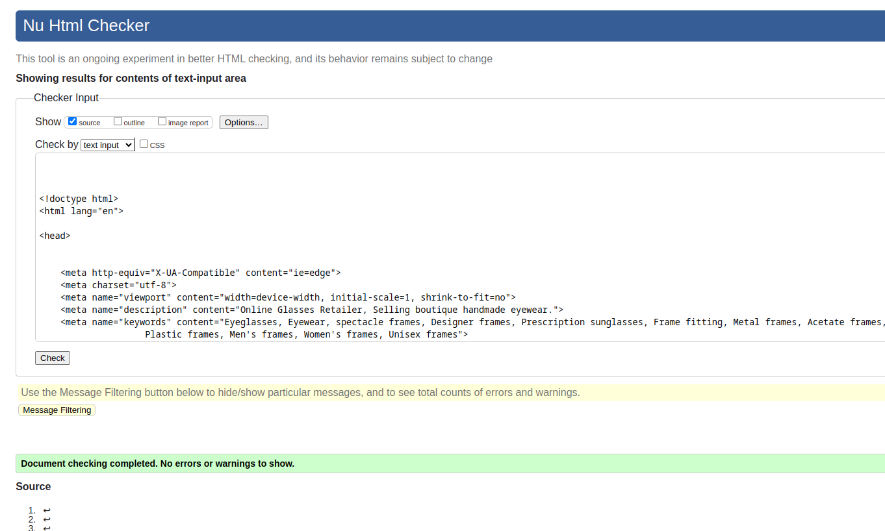 
Pass: No Errors

| Log Out | 
 
Pass: No Errors

| Checkout Bag | 

Pass: No Errors

Checkout Bag | 
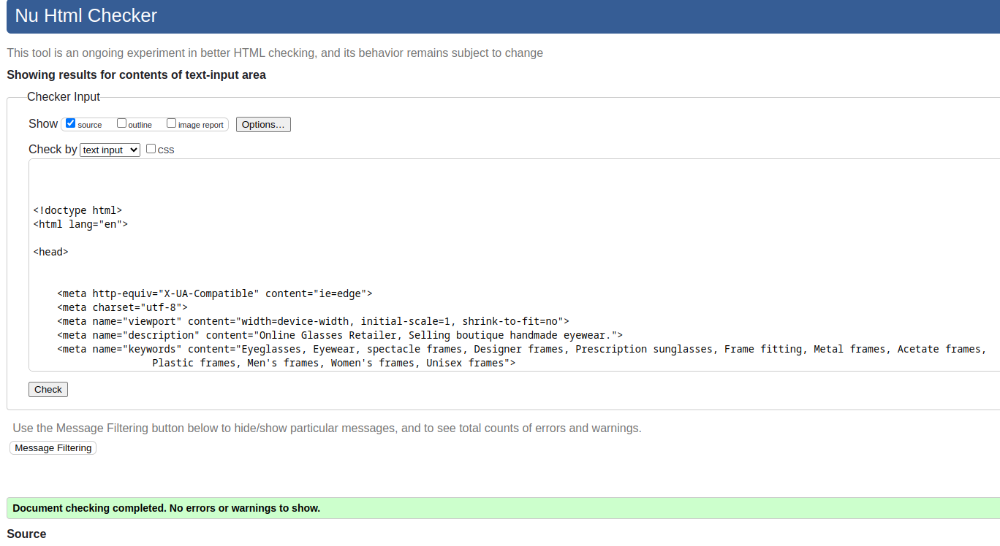 
Pass: No Errors |

| Checkout | 

 Warning: Empty heading (Loading spinner after submitting checkout form)

| Checkout Success

Pass: No Errors
| Profile | 
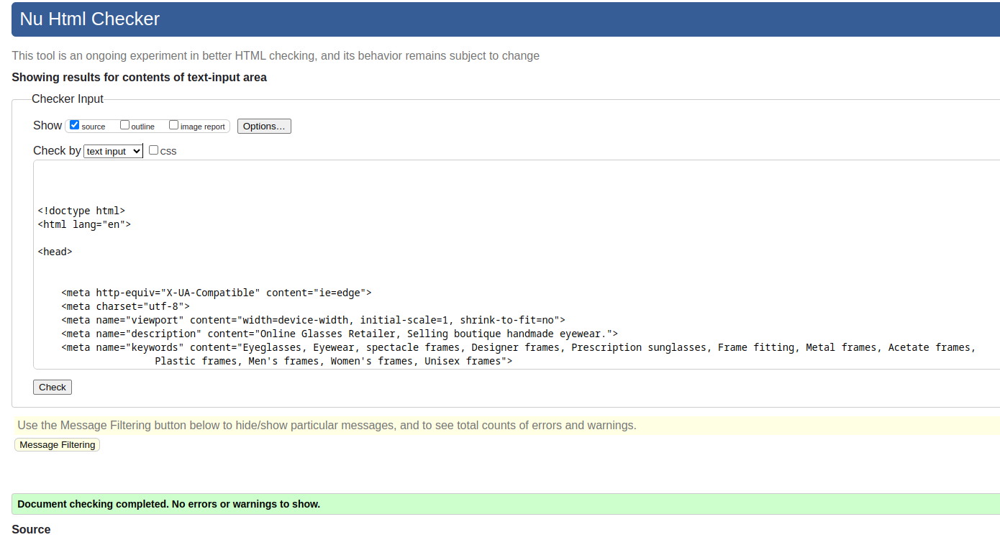 
Pass: No Errors

| Add Product  |
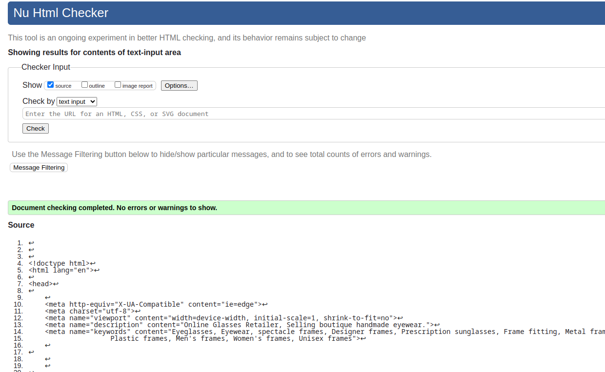 
Pass: No Errors

| Edit Product  |
 
Error: An img element must have an alt attribute, except under certain conditions (Current image for product being edited)

| Delete Product  
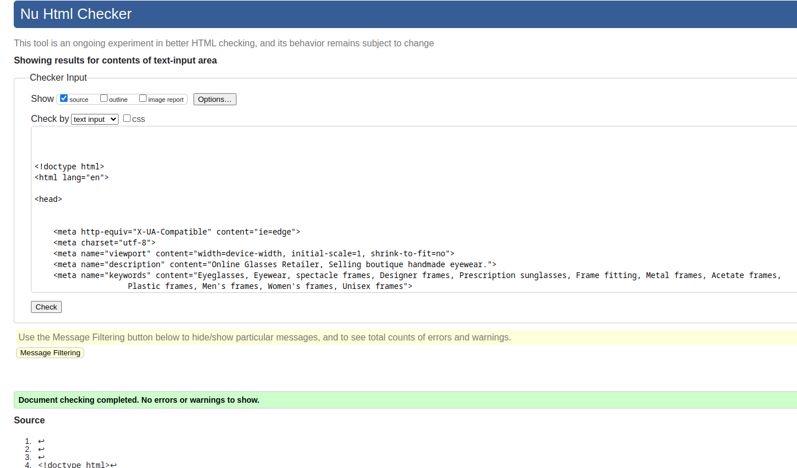 
Pass: No Errors

| Add Blog |
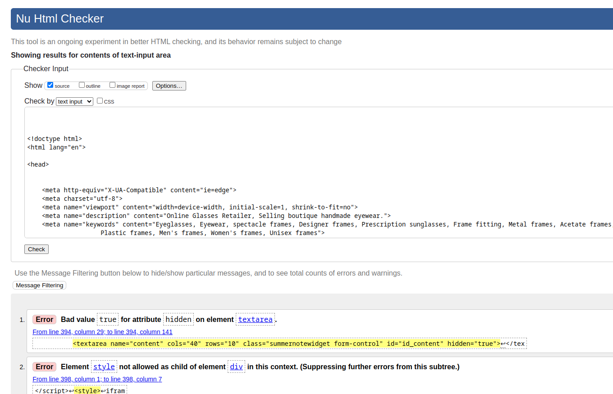
Multiple Errors all from summernote widget for blog content field

| Edit Blog |
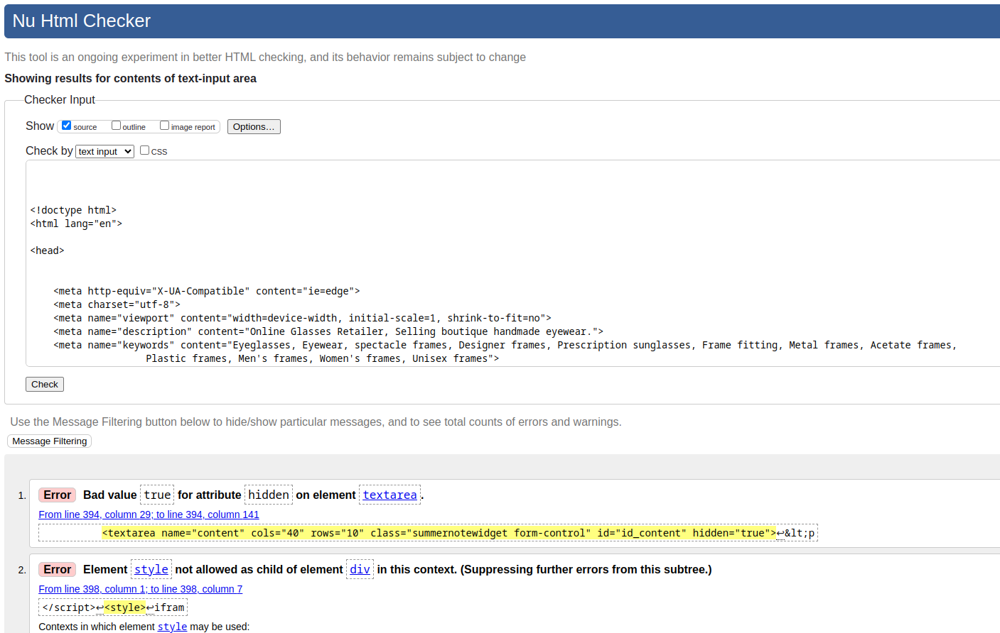
Multiple Errors all from summernote widget for blog content field

| Delete Blog |
 
Pass: No Errors 

| Contact us | 

Pass: No Errors 

| Contact us Success |
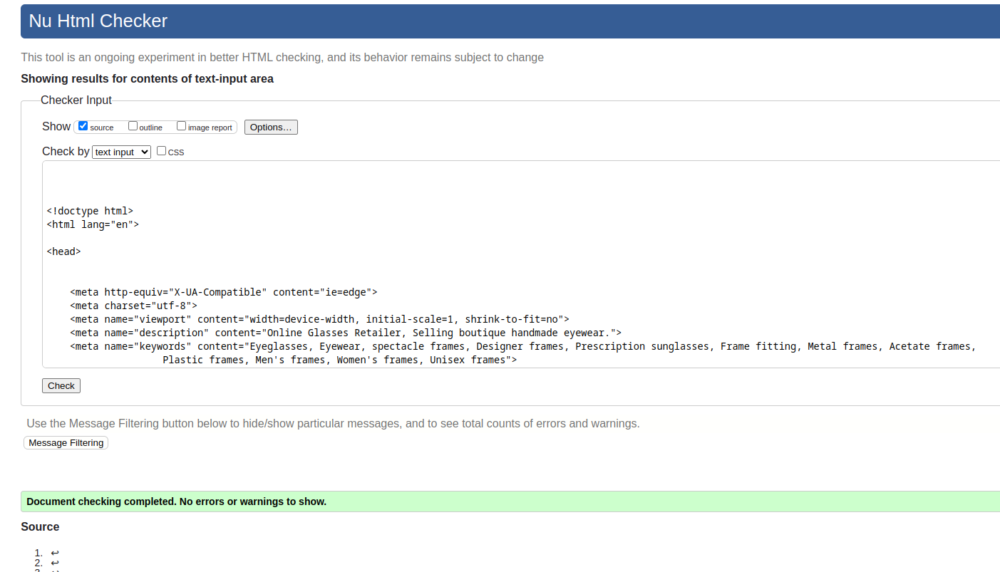 
Pass: No Errors

| Reviews |
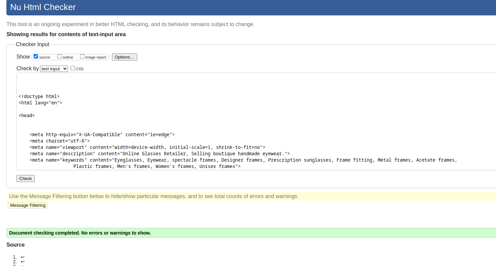 
Pass: No Errors |
